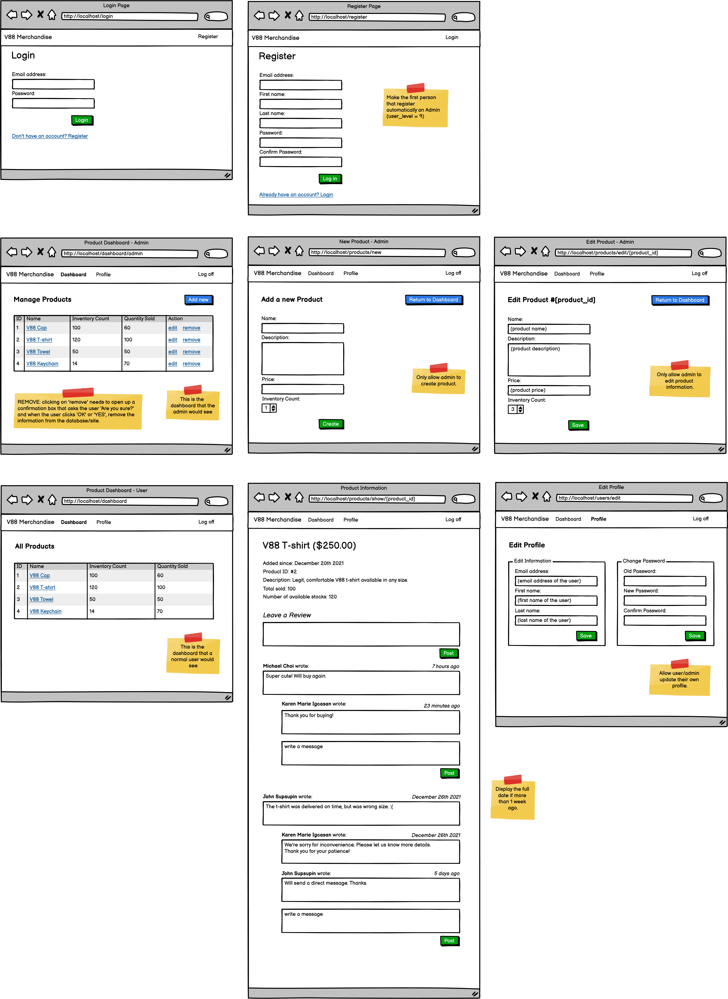

###################
Product Dashboard
###################
*************
 Technologies
*************
    • Codeigniter 3 (MVC framework)
    • MySQL (database)
********
Features
********
    Authentication:
        • Signup
            - User can register a new account
            - Form input validation ensures valid data entry
            - Email uniqueness is checked in the database
            - Password is securely hashed before storing (using BYCRYPT)
        • Login
            - Existing users can login using email and password
            - Form input validation ensures valid credentials
            - Email existence is checked in the database

    User Management:
        • Admin Dashboard
            - Add, edit and delete products
            - Manage product information and details
        • User / Admin
            - Add comments/reviews to a products
            - Reply to existing comments/reviews on products.
            - Update user profile information and password

*********
Wireframe
*********

*******************
System Requirements
*******************
    • PHP 7.4 or later
    • MySQL 8 or later
    • Web server(Apache)

************
Installation
************
    1. Download the project files
    2. Import the database sql(product_dashboard.sql)  file located in the root folder into your MySQL database.
    3. Optional: Populate the tables using the csv files / create your own
    4. Edit the application/config/database.php file with your database credentials.
    5. Run composer install to install the project dependencies.
    6. Run php spark migrate -all to create the database tables.
    7. Access the application through your web browser.

    Note: 
        • If you populate your database using the csv files, you can use this accounts to login
            - user: { email: 'john_doe@email.com', password: 'test1234'}
            - admin: {email: 'john_wick@email.com', password: 'admin1234'}
        
        • Do a manual query for creating admin

**********
Disclaimer
***********
    - This project is 80-90% complete
    - Have minor bugs

Contributing
    - Please report any bugs or suggestions through the project issue tracke
